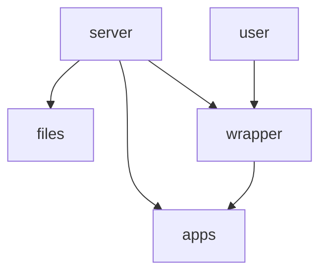
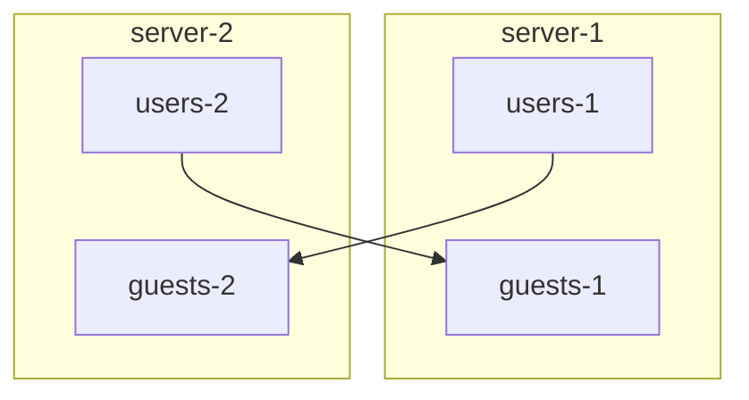

# Rustdrive

This project with aims to create a intuitive cloud.

I host a nextcloud, but some of my clients are confused over the loads of options they have. Just to look at a files details there are multible tabs and options. So i decided that it is time again for a Project. It propably only will be for learning purposes, but you will never know..

## Structure

The Server is built like a static webserver. Acess control is built with json files. The API is application agnostic, it just delivers a file-storage backend for the Applications.

## Federation

A big goal of this project is smooth and intuitive federation. A server stores users and guests. Guests are users from other servers, that need credentials on this server. 

