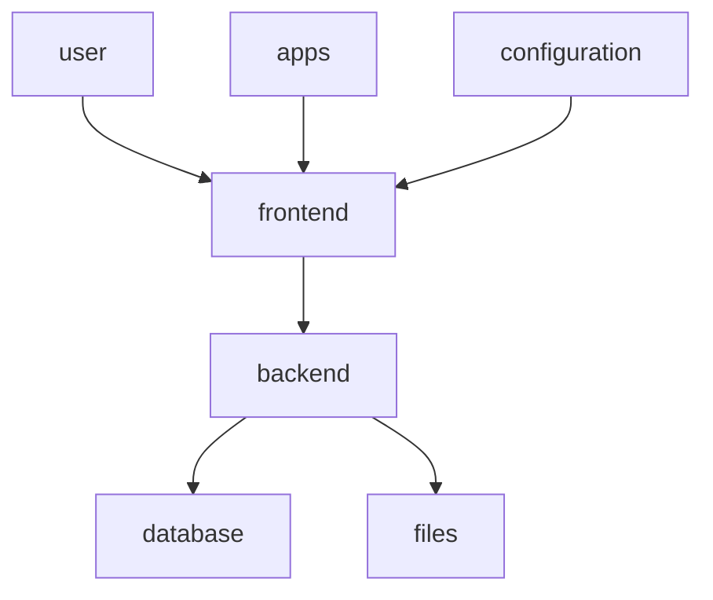

# Rustdrive

The goal of this project is to create a cloud that is easy to use for users

There are many cloud services you can host, but most users are confused by the variety of options available to them. To view file details, there are several tabs and options in Nextcloud. So the aim of this project is to create a cloud that makes cloud services easier. It'll probably just be for learning purposes, but we'll never know...

|||||

|---------------------|--------------------|--------------------|---------------------|

## Authors

- [@Soraxem](https://github.com/Soraxem)

## Structure

