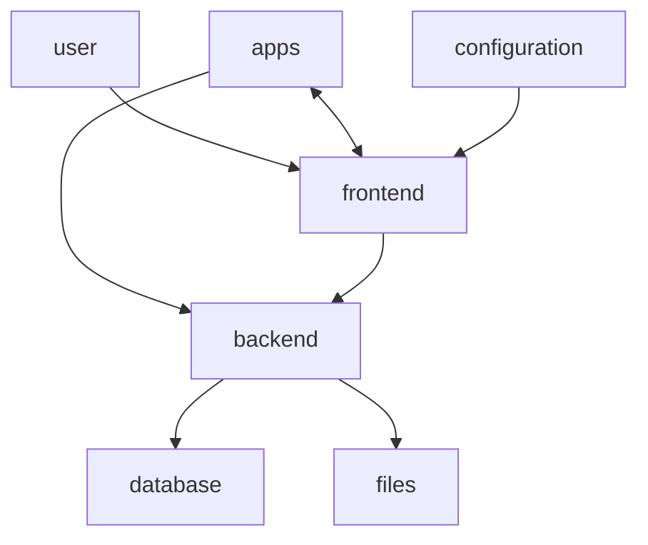

# Rustdrive

This project with aims to create a intuitive cloud.

I host a nextcloud, but some of my clients are confused over the loads of options they have. Just to look at a files details there are multible tabs and options. So i decided that it is time again for a Project. It propably only will be for learning purposes, but you will never know..

## Structure

Front and Backend are as much seperated as possible. By that they get interchangeable. You could host the frontend on any static webserver and have the backend be on any other Device with Rust and Internet. By that you can alter the design and functionallity of the apps, without touching the Backend. This architecture also ensures that only the API has to be secure.

